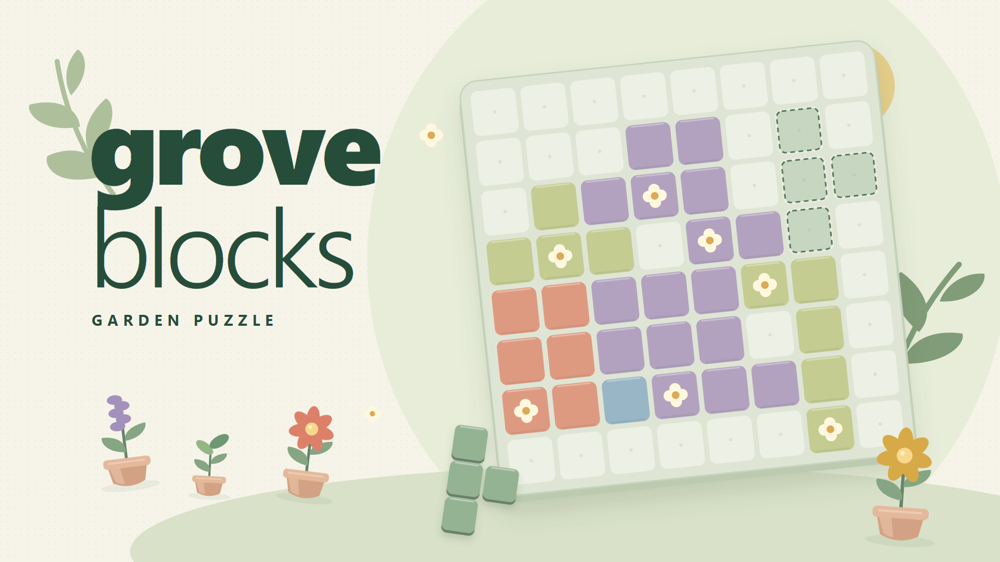

# Grove Blocks — Garden Puzzle

Un puzzle relaxant de browser: așezi piese pe o tablă de 8×8, completezi linii, culegi flori și construiești o mică grădină. Jocul intră direct în partidă și include control cu mouse, touch și tastatură, două moduri de joc și progres salvat local.

**Joacă online:** [Grove Blocks](https://sugartm1.github.io/grove-blocks/)



**Repository:** [SugarTM1/grove-blocks](https://github.com/SugarTM1/grove-blocks)

## De ce acest joc

Conceptul a fost ales după compararea unor jocuri publicate pe CrazyGames, cu două criterii: semnale publice de interes și fezabilitatea unui joc complet, rapid și bine finisat, fără infrastructură de server. Tema botanică, puterea Bloom și colecția adaugă obiective proprii unui mecanism familiar.

Vezi [cercetarea în română](docs/RESEARCH.ro.md), [datele publice consultate](docs/market-snapshot.json) și [pregătirea pentru CrazyGames](docs/CRAZYGAMES.md). Ratingurile concurenților nu măsoară traficul organic. Acceptarea, expunerea și rezultatele acestui joc trebuie validate prin jucători reali.

## Pornire locală

Necesită **Node.js 22 sau mai nou**. Din folderul proiectului:

```sh
npm install
npm start
```

Deschide [http://localhost:4173](http://localhost:4173). Serverul ascultă doar pe calculatorul local. Jocul folosește module JavaScript, deci deschide-l prin HTTP, nu prin dublu-click pe `index.html` / `file://`.

Jocul propriu-zis nu are dependențe de runtime instalate prin npm. Pachetul Playwright este folosit pentru verificări în browser. În modul standalone, jocul nu încarcă fonturi, imagini, sunete sau SDK-uri externe; poate fi jucat fără internet cât timp serverul local funcționează.

## Cum se joacă

- **Mouse / touch:** trage o piesă pe tablă sau selecteaz-o și apoi apasă pătratul unde vrei colțul ei din stânga sus. Piesele nu se rotesc.
- **Tastatură:** `1`, `2`, `3` aleg piesa; săgețile mută previzualizarea; `Enter` sau `Space` plasează. `H` oferă un indiciu, `U` anulează ultima acțiune, `B` activează Bloom.
- **Linii:** un rând sau o coloană completă dispare. Intersecțiile sunt curățate o singură dată.
- **Flori:** curățarea unei linii cu flori dezvoltă colecția și umple contorul Bloom. La 8 flori, Bloom poate elibera o zonă de până la 3×3 pătrate, centrată pe pătratul ales.
- **Ajutoare:** indiciile sunt gratuite; ai trei utilizări Undo pe partidă. Undo păstrează numai ultima acțiune, fără istoric pe mai multe niveluri.

**Classic** continuă până când nicio piesă disponibilă nu mai încape și Bloom nu este încărcat. **Daily garden** oferă o provocare de maximum 30 de plasări, cu aceeași sămânță și aceeași tablă inițială pentru ziua UTC; mutările tale influențează starea și adaptarea pieselor următoare. Poți rejuca provocarea pentru un scor mai bun. O grădină nouă devine disponibilă la miezul nopții UTC.

## Punctaj și progres

| Acțiune | Puncte |
| --- | ---: |
| Fiecare pătrat din piesa plasată | 5 |
| Fiecare rând sau coloană curățată | 100 |
| Fiecare linie suplimentară curățată simultan, după prima | 75 |
| Bonus de serie pentru o mutare care curăță linii | 50 × (lungimea seriei − 1) |
| Fiecare floare culeasă prin curățarea liniilor | 35 |

O plasare fără linii curățate întrerupe seria. Bloom nu acordă puncte sau flori și nu consumă o plasare din limita Daily. Contorul se oprește la 8; florile în plus contribuie în continuare la colecție.

Colecția conține **9 plante**. Paletele Meadow, Clay și Dusk se deblochează la 0, 40 și 120 de flori. Partidele Classic și Daily au salvări separate; scorul personal, colecția, paleta și sunetul sunt păstrate în browser. Progresul nu se sincronizează între dispozitive, iar ștergerea datelor browserului îl elimină. Dacă stocarea este indisponibilă, jocul continuă în sesiunea curentă.

## Ce include

- Reguli deterministe și salvări validate înainte de încărcare.
- Previzualizare pentru plasări valide, invalide și linii care urmează să dispară.
- Animații de curățare, particule și respectarea preferinței de reducere a mișcării.
- Ilustrații SVG și elemente grafice CSS create pentru proiect; sunete procedurale prin Web Audio, cu opțiune mute.
- Interfață în engleză, adaptată pentru desktop și mobil, fără cont obligatoriu sau reclame.
- Adaptor opțional CrazyGames SDK v3, pentru evenimente de încărcare și gameplay.

## Verificare și build

```sh
npm test
npm run build
npm start -- --dist
```

`npm test` verifică motorul puzzle și integrarea SDK simulată. `npm run build` creează `dist/` cu fișierele necesare jocului. Ultima comandă servește acel build pentru verificare. Oprește serverul anterior înainte de a porni altul pe același port.

Pentru verificările în browser, folosește `npm run test:browser` după pregătirea browserului Playwright. Rezultatele confirmate și verificările rămase sunt documentate în [QA](docs/QA.md).

În PowerShell, poți arhiva buildul astfel:

```powershell
pwsh -File scripts/package.ps1
```

Scriptul creează `release/grove-blocks-crazygames.zip` și kitul complet `release/grove-blocks-submission-kit.zip`. Arhivele publicate sunt disponibile în [Releases](https://github.com/SugarTM1/grove-blocks/releases).

Copertele se regenerează cu `node scripts/create-covers.mjs`. Cu serverul local pornit, `node scripts/record-preview.mjs` înregistrează clipurile de gameplay.

`index.html` trebuie să fie direct la rădăcina arhivei. Nu include `node_modules`, `.git`, documentația sau testele în upload.

## CrazyGames

Versiunea aceasta vizează **Basic Launch**, unde SDK-ul este opțional și monetizarea este dezactivată. Adaptorul folosește SDK v3 numai pe domeniile CrazyGames detectate sau când adaugi explicit `?crazygames=true` pentru QA. Pentru un test local conectat la internet, deschide [http://localhost:4173/?crazygames=true](http://localhost:4173/?crazygames=true).

Buildul nu include reclame, plăți, conturi, clasamente online sau salvări cloud. Nu reprezintă o implementare Full Launch completă și nici o acceptare pe platformă. Cerințele de copertă, video, preview și integrarea care mai trebuie evaluată sunt în [ghidul de trimitere](docs/CRAZYGAMES.md).

## Drepturi

Codul și grafica jocului sunt create pentru acest proiect. Nu a fost adăugată o licență open-source care să acorde drepturi de redistribuire; titularul proiectului poate alege ulterior condițiile de utilizare. Dependențele de dezvoltare își păstrează propriile licențe.
